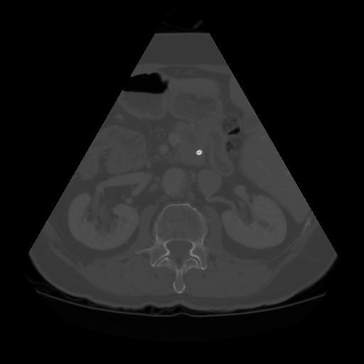
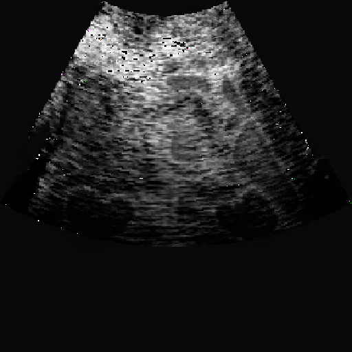

# Semantically Ct-Ultrasound image-to-image translation
 

This is the project for unpaired i2i translation between CT and ultrasound images, following the structure of [pytorch-CycleGAN-and-pix2pix](https://github.com/junyanz/pytorch-CycleGAN-and-pix2pix), with multiple modifications inserted. The structure of codes are maintained as similar to the original CycleGAN repository as possible so that further extensions can be easierly implemented.

## Dataset
### Abdominal CT dataset
[AbdomenCT-1K](https://github.com/JunMa11/AbdomenCT-1K). We used the fully annotated part of this benchmark (https://abdomenct-1k-fully-supervised-learning.grand-challenge.org/). Please refer to the instructions in CT_preprocessing folder to check how to deal with the raw CT data.

### Abdominal Ultrasound dataset
(https://www.kaggle.com/datasets/ignaciorlando/ussimandsegm)

## Train
```bash
python train.py --dataroot ./datasets/ctus --name ctus_cyclegan --model cycle_gan
```


